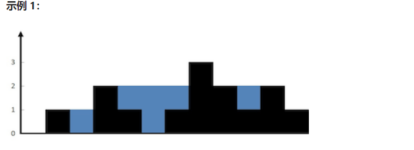

# [42. 接雨水](https://leetcode.cn/problems/trapping-rain-water/)


**给定 `n` 个非负整数表示每个宽度为 `1` 的柱子的高度图，计算按此排列的柱子，下雨之后能接多少雨水。**

 



```markdown
输入：height = [0,1,0,2,1,0,1,3,2,1,2,1]
输出：6
解释：上面是由数组 [0,1,0,2,1,0,1,3,2,1,2,1] 表示的高度图，在这种情况下，可以接 6 个单位的雨水（蓝色部分表示雨水）。
```

思路1：

​	维护一个left切片 left[i+1]代表height[0]到height[i]最大的height，先从左遍历height填充left，然后从右开始遍历 用一个r代表当前节点到末尾最大的height，最终结果等于每个height左边最大和右边最大的最小值减去当前节点的高度累加起来。

```go
func trap(height []int) (ans int){
    left := make([]int,len(height)+1)
    for i,h :=range height{
        left[i+1]=max(left[i],h)
    }
    for i,r:=len(height)-1,0;i>=0;i--{
        r = max(r,height[i])
        ans +=min(left[i+1],r)-height[i]
    }
    return
}
```

思路2：

​	双指针

​	针对left，right二个指针指向数组的首尾，遍历数组，如果height[left]<height[right]，那么我们就从小的这边left开始往right那边寻找，如果left的下一个是小于height[left]那么我们需要将height[left]-height[left+1]的值加入maxSum中，然后将当前值填平为height[left]，知道i>right或者height[i]>height[left],反之右边同理。

```go
func trap(height []int) int{
    if len(height)<=2{
        return 0
    }
    left,right :=0,len(height)-1
    maxSum :=0
    for left<right{
        if height[left]<height[right]{
            for i:=left+1;i<right&&height[i]<height[left];i++{
                maxSum+=height[left]-height[i]
                height[i]=height[left]
            }
            left++
        }else{
            for i:=right-1;i>left&&height[i]<height[right];i--{
                maxSum+=height[right]-height[i]
                height[i]=height[right]
            }
            right--
        }
    }
    return maxSum
}
```

