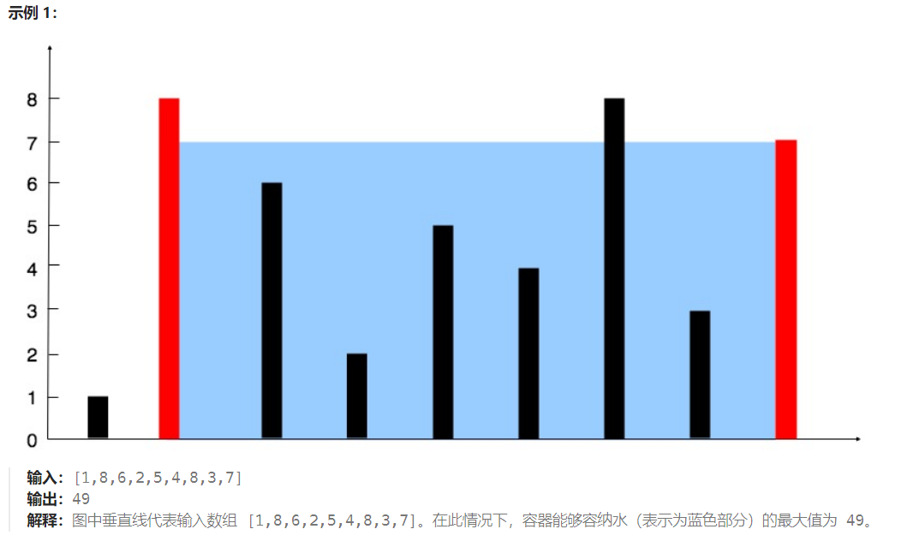

# [11. 盛最多水的容器](https://leetcode.cn/problems/container-with-most-water/)


**给定一个长度为 `n` 的整数数组 `height` 。有 `n` 条垂线，第 `i` 条线的两个端点是 `(i, 0)` 和 `(i, height[i])` 。**

**找出其中的两条线，使得它们与 `x` 轴共同构成的容器可以容纳最多的水。**

**返回容器可以储存的最大水量。**

**说明：你不能倾斜容器。**




```markdown
输入：[1,8,6,2,5,4,8,3,7]
输出：49 
解释：图中垂直线代表输入数组 [1,8,6,2,5,4,8,3,7]。在此情况下，容器能够容纳水（表示为蓝色部分）的最大值为 49。
```


思路：

​	定义左右指针left，right，用res先记录(right-left)*min(height[left],height[right]),然后比较height[left]和height[right] 左边小移动left++，右边小移动right--，res比较本身和乘积的最大值。


```go
func maxArea(height []int) int {
    left,right := 0,len(height)-1
    if right==0{
        return 0
    }
    res := 0
    for left<right{
        if height[left]<height[right]{
            res = max(res,(right-left)*height[left])
            left++
        }else{
            res = max(res,(right-left)*height[right])
            right--
        }
       
    }
    return res
}
```

